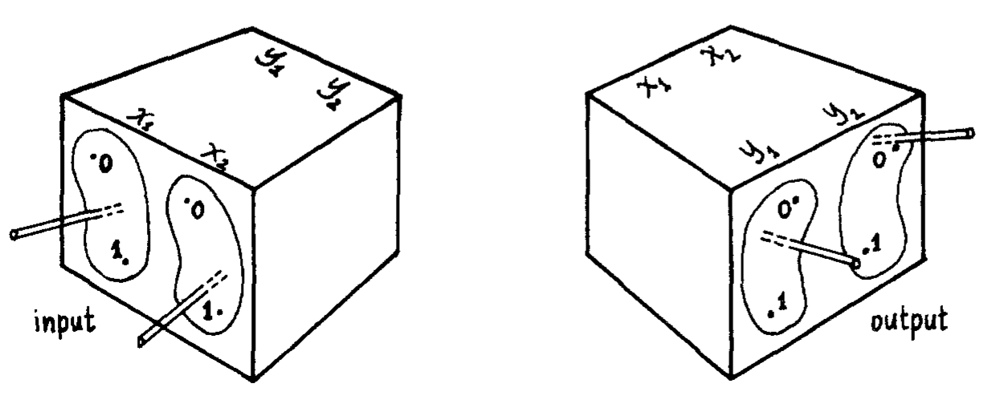
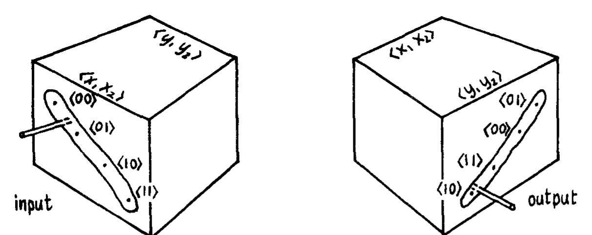
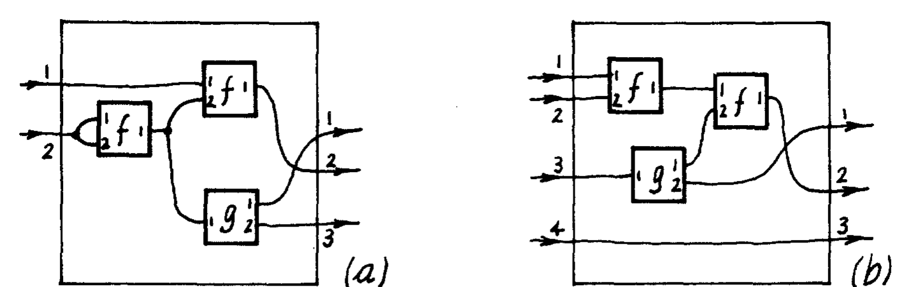
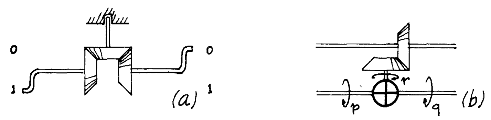
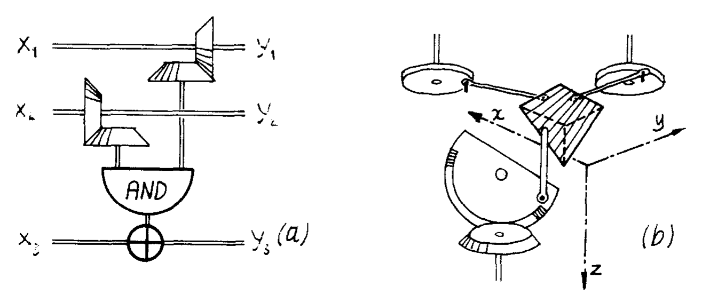
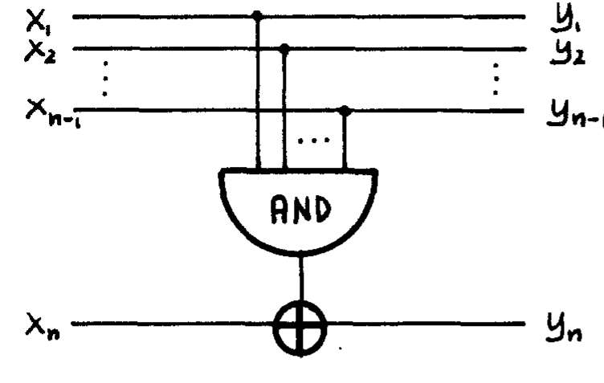
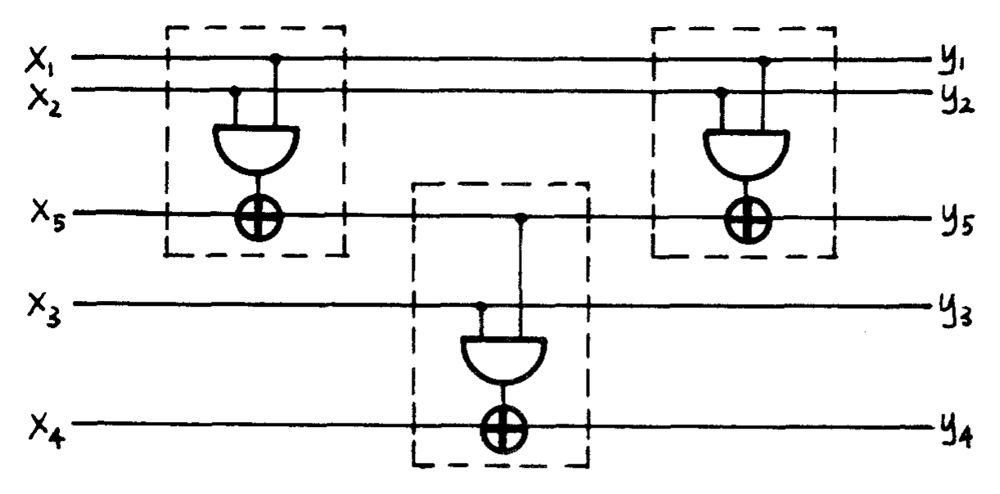

# Bicontinuous Extensions of Invertible Combinatorial Functions[^support]

**Tommaso Toffoli**  
MIT Laboratory for Computer Science, 545 Technology Sq., Cambridge, MA 02139

*Math. Systems Theory 14, 13-23 (1981)*

## Abstract

We discuss and solve the problem of constructing a diffeomorphic componentwise extension for an arbitrary invertible combinatorial function. Interpreted in physical terms, our solution constitutes a proof of the physical realizability of general computing mechanisms based on reversible primitives.

## 1. Motivations

In an ordinary digital computer, the two logic states associated with a binary signal are realized as distinguished values of a continuous variable which represents the range of a physical quantity; correspondingly, the logic function associated with a given combinatorial network is realized as the appropriate restriction of a suitable continuous function which characterizes a physical system involving a number of such quantities. If the logic function is not invertible (note that a computation may yield the same output for different inputs), its continuous extension cannot be invertible. On the other hand, the microscopic physical laws which underly the operation of a computer are presumed to be strictly reversible, i.e., they uniquely specify a trajectory both forward and backward in time. Thus, it is clear that a noninvertible continuous function such as the above may characterize a physical system only in terms of statistical mechanics, rather than of microscopic mechanics. In other words, such a function is necessarily an incomplete specification of a mechanical system [1]; in particular, it does not give one the means to deal in any detail with the information that is "discarded" during a computation, besides accounting for it in terms of the increase of a single scalar quantity, the entropy of the system [2].

In an attempt to exercise some control on the details of the work-to-heat conversion processes that accompany physical computing (and which are related to the irreversibility of computation), a different approach to the mathematical modeling and the design of computers has been suggested by several authors (see Appendix for a brief summary and references). In that approach, generically termed reversible computing, a major obstacle to arriving at a complete mechanical specification of a computing system is removed, since computation is there modeled exclusively in terms of invertible combinatorial functions. It remains to show that such functions admit in general of a physical realization. This we do in the present paper.

## 2. Statement of the problem

**Goal 2.1.** Given the set $B=\{0,1\}$ and an invertible function $f^{(n)}:B^n\to B^n$, find a connected manifold $M\supseteq B$ and a diffeomorphism $F^{(n)}:M^n\to M^n$ such that $f^{(n)}$ is a restriction of $F^{(n)}$.

Our goal can be given the following kinematical interpretation. Consider a box having $n$ input levers and $n$ output levers, as depicted in Fig. 1 for $n=2$.

$M$ represents the range of accessible positions for each lever (a manifold is the appropriate mathematical structure for describing this range). Two distinguished positions within $M$ are marked "0" and "1". Assume that the input levers are interconnected to the output ones by means of a passive physical mechanism (for instance, an assembly of gears, cams, etc.) in such a way that

(a) When all input levers occupy distinguished positions, so do all the output ones. In this way, the box "computes" a combinatorial function from binary $n$-tuples to binary $n$-tuples.

(b) The collective configuration of the output levers is a continuous function of the input configuration. Continuity should extend to the higher derivatives (velocity, acceleration, etc.).

(c) The box is reversible, i.e., condition (b) holds when input and output levers are exchanged.

Clearly, (c) implies that (a) too holds when input and output levers are exchanged. Thus, the combinatorial function "computed" by the box must be invertible. We want design principles to construct a box with the above properties for any invertible combinatorial function $f^{(n)}$. The specifications for such a box will be represented by a diffeomorphism $F^{(n)}$ from $M^n$ to $M^n$. (When one is dealing with manifolds instead of intervals of the real line, a diffeomorphism is the appropriate generalization of a bicontinuous function.)

*Fig. 1. Realization of a combinatorial function by means of continuous mechanisms.*

It must be stressed that Goal 2.1 does not just ask for an arbitrary diffeomorphic extension of the given function $f^{(n)}$ to an arbitrary manifold. Rather, the extension must be componentwise. In other words, besides being a superset of $B^n$, the manifold must also be of the form $M^n$, i.e., possess the same Cartesian product structure as $B^n$; moreover, the extension itself must maintain the variables separated, i.e., each component of the extension must be an extension of the corresponding component of the given function. In physical terms, each binary variable must be encoded in a separate "channel," so that in interconnecting several boxes of this kind each variable may be routed independently of the others. Fig. 2 illustrates the case of an extension that is not componentwise. This box too "computes" a combinatorial function, but it is hard to see how the components of the input $n$-tuple could be made to come from different boxes, and those of the output $n$-tuple go to different boxes, without using complex encoders and decoders for which the problem of physical realizability would arise afresh.

*Fig. 2. An extension which is not componentwise. Only one degree of freedom is used to represent several binary variables.*

## 3. Notation and Mathematical Preliminaries

We shall be dealing exclusively with functions that are invertible, and whose domain and range are structured sets, i.e., are explicitly given as indexed Cartesian products of sets. In particular, in all cases domain and range will be products of identical sets and will coincide.

A restriction of a function of the form $\Phi:\bar{A}\to\bar{B}$ is usually defined by specifying a subset $A$ of the domain $\bar{A}$. However, when invertibility is an issue, it is necessary to explicitly specify also the restriction's intended range. Thus, by the restriction of $\Phi$ to $\langle A,B\rangle$ (where $A\subseteq\bar{A}$ and $B\subseteq\bar{B}$) we shall mean the relation $\phi$ from $A$ to $B$ such that $a\phi b$ whenever $a\in A$, $b\in B$, and $\Phi(a)=b$. Whether $\phi$ is indeed a function, and an invertible one for that matter, depends on the choice of $A$ and $B$. If $\phi$ is the restriction of $\Phi$ to $\langle A,B\rangle$, then $\Phi$ is an extension of $\phi$ to $\langle \bar{A},\bar{B}\rangle$.

Given $\phi:A_1\times\cdots\times A_m\to B_1\times\cdots\times B_n$, an extension $\Phi$ of $\phi$ to $\langle P,Q\rangle$ is componentwise if there exist sets $\bar{A}_i\supseteq A_i$ and $\bar{B}_i\supseteq B_i$ such that $P=\bar{A}_1\times\cdots\times\bar{A}_m$ and $Q=\bar{B}_1\times\cdots\times\bar{B}_n$. In this case, $\phi$ is a componentwise restriction of $\Phi$.

When the domain of a function is an indexed Cartesian product of sets, it is convenient to speak of input variables (or input components, or, simply, arguments) of the function, using the same indexing as for the corresponding sets. If also the range of the function is an indexed Cartesian product, one may likewise speak of output variables (or output components) of the function. In ordinary function composition, an output variable of one function may be substituted for any number of input variables of other functions, i.e., "fan-out" is allowed, as indicated in Fig. 3a. In what follows, we shall use a more restricted form of composition, called one-to-one composition, where any substitution of output variables for input variables must be one-to-one, as indicated in Fig. 3b. If the output variable and the input variable involved in every such substitution range over identical sets, then one-to-one composition always yields invertible functions when applied to invertible functions.

*Fig. 3. (a) Examples of ordinary composition and (b) one-to-one composition of functions.*

A reindexing of input or output variables is a special case of one-to-one composition. One-to-one composition is conveniently handled by means of an algebraic notation formally analogous to that of tensor calculus [3]. From a physical viewpoint, the one-to-one constraint reflects the fact that signal fan-out requires a source of energy other than that carried by the signal itself.

Let $\phi$ be a binary relation from $S\times U_1\times\cdots\times U_n$ to $S'\times U'_1\times\cdots\times U'_{n'}$, where $S,S'$ are arbitrary sets and $U_1,\ldots,U_n,U'_1,\ldots,U'_{n'}$ are singletons. For convenience, the one element of any of these singletons will be denoted by $o$. The variables associated with these singletons will be called dummy. A relation $\bar{\phi}$ from $S\times U_{i_1}\times\cdots\times U_{i_p}$ to $S'\times U'_{j_1}\times\cdots\times U'_{j_{p'}}$, where $1\le i_1<\cdots<i_p\le n$ and $1\le j_1<\cdots<j_{p'}\le n'$, is said to be obtained from $\phi$ by deletion of dummy variables if

$$
\langle s,\underbrace{o,\ldots,o}_{n}\rangle\,\phi\,\langle s',\underbrace{o,\ldots,o}_{n'}\rangle
\Longleftrightarrow
\langle s,\underbrace{o,\ldots,o}_{p}\rangle\,\bar{\phi}\,\langle s',\underbrace{o,\ldots,o}_{p'}\rangle,
$$

that is, if the two relations coincide when the trailing $o$'s which accompany each tuple are disregarded.

Finally, a combinatorial function is one of the form $f:B^m\to B^n$, where $B$ is the binary set $\{0,1\}$.

## 4. Main Results

**Definition 4.1.** Consider the set $B=\{0,1\}$ with the usual structure of Boolean ring, with "$\oplus$" (exclusive-or) denoting the addition operator, "$\ominus$" the additive-inverse operator (which in this case coincides with the identity operator), and "$\circ$" (AND) the multiplication operator. For any $n>0$, the AND/NAND function of order $n$, denoted by $\theta^{(n)}:B^n\to B^n$, is defined by

$$
\theta^{(n)}:
\begin{bmatrix}
 x_1\\
 x_2\\
 \vdots\\
 x_{n-1}\\
 x_n
\end{bmatrix}
\mapsto
\begin{bmatrix}
 x_1\\
 x_2\\
 \vdots\\
 x_{n-1}\\
 \ominus x_n\oplus(x_1\circ x_2\circ\cdots\circ x_{n-1})
\end{bmatrix}.
\tag{4.1}
$$

**Remark 4.1.** (a) The $\ominus$ sign in (4.1), which is redundant (since $\ominus x_n=x_n$), has been introduced for symmetry with (4.2) below, where it is not redundant. (b) For any $n>0$, $\theta^{(n)}$ is invertible and coincides with its inverse. (c) For $i=1,2,\ldots,n-1$, the $i$-th component of $\theta^{(n)}$, i.e., $\theta_i^{(n)}$, coincides with the selector operator for the corresponding argument, i.e., $\theta_i^{(n)}(x_1,\ldots,x_n)=x_i$. (d) The last component of $\theta^{(n)}$, i.e., $\theta_n^{(n)}$, coincides with the Boolean-complement operator for $n=1$ (the empty product is 1), and with the exclusive-or of its two arguments for $n=2$. (e) For all other values of $n$, $\theta_n^{(n)}$ is still linear in the $n$-th argument, but is nonlinear in the first $n-1$ arguments.

The family of AND/NAND functions was introduced by Toffoli [7] for proving the computation and construction universality of reversible cellular automata. An earlier, brief mention of the AND/NAND function of order 3 can be found in [2].

**Lemma 4.1.** Any invertible combinatorial function of order $n$ can be obtained by one-to-one composition of AND/NAND functions of order $\le n$.

**Proof.** In the following construction we shall make use only of $\theta^{(n)}$ (where $n$ is the order of the given function) and of $\theta^{(1)}$ (the Boolean-complement operator).

By definition, $f^{(n)}$ is a permutation on the set of $n$-tuples over $B$. (a) Any permutation can be written as the product of elementary permutations, i.e., of permutations that exchange only two $n$-tuples. In turn, as we shall prove below, (b) any elementary permutation of $B^n$ can be written as the product of atomic permutations, i.e., of permutations that exchange two $n$-tuples which differ in only one component. Observe that $\theta^{(n)}$ is the atomic permutation which exchanges $\langle1,1,\ldots,1,0\rangle$ with $\langle1,1,\ldots,1,1\rangle$. By reordering the components of $\theta^{(n)}$ and applying $\theta^{(1)}$ to selected components one obtains the family of all atomic permutations. Note that all the operations used above are forms of one-to-one composition. It remains to prove (b); this is done in the following way.

The $n$-tuples $a_1,a_2,\ldots,a_i$ are said to form a Gray-code path if two adjacent $n$-tuples differ by an atomic permutation. It is easy to verify that by means of a sequence of atomic permutations the element at the beginning of the path can be moved to the end position, leaving the remainder of the path unchanged. By repeating such a move the first and last elements can be exchanged. The proof is completed by observing that any two $n$-tuples can be joined by a Gray-code path. $\square$

**Lemma 4.2.** Consider the 1-manifold $\mathring{R}$ obtained by identifying all points of the real line $R$ that differ by a multiple of $2\pi$ ($\mathring{R}$ can be thought of as the real circle), and let the points 0 and 1 of $B$ coincide with, respectively, 0 and $\pi$ of $\mathring{R}$. Then there exists a diffeomorphism from $\mathring{R}^n$ to $\mathring{R}^n$ whose restriction to $\langle B^n,B^n\rangle$ coincides with $\theta^{(n)}$.

**Proof.** Consider $\mathring{R}$ with addition ("$\oplus$") and additive inverse ("$\ominus$") induced from those on $R$, and multiplication ("$\circ$") defined as follows:

$$
x\circ y = \pi\,{1-\cos x\over 2}\,{1-\cos y\over 2}.
$$

$\mathring{R}$ satisfies all the axioms for a ring except distributivity. Let $\Theta^{(n)}:\mathring{R}^n\to\mathring{R}^n$ be defined by

$$
\Theta^{(n)}:
\begin{bmatrix}
 x_1\\
 x_2\\
 \vdots\\
 x_{n-1}\\
 x_n
\end{bmatrix}
\mapsto
\begin{bmatrix}
 x_1\\
 x_2\\
 \vdots\\
 x_{n-1}\\
 \ominus x_n\oplus(x_1\circ x_2\circ\cdots\circ x_{n-1})
\end{bmatrix}.
\tag{4.2}
$$

Observe that when the operators defined on $\mathring{R}$ are restricted to $B\subseteq\mathring{R}$ the Boolean-ring structure for $B$ is recovered; thus, the restriction of $\Theta^{(n)}$ to $\langle B^n,B^n\rangle$ coincides with $\theta^{(n)}$. Moreover, $\Theta^{(n)}$ is infinitely differentiable by construction and coincides with its inverse; thus, $\Theta^{(n)}$ is a diffeomorphism. $\square$

As an immediate consequence of Lemmas 4.1 and 4.2, one obtains the following theorem (cf. Goal 2.1).

**Theorem 4.1.** Given any invertible combinatorial function $f^{(n)}:B^n\to B^n$, there exist a connected manifold $M\supseteq B$ and a diffeomorphism $F^{(n)}:M^n\to M^n$ such that $f^{(n)}$ is the restriction of $F^{(n)}$ to $\langle B^n,B^n\rangle$.

## 5. Additional Results

Before continuing with our mathematical exposition, it will be useful to verify in an intuitive way the physical realizability of the functions $\Theta^{(n)}$. With reference to Fig. 2.1, we shall consider boxes whose input and output levers are constrained to circular motion (i.e., are cranks). In close correspondence with the defining formula (4.2), $\Theta^{(1)}$ will be realized as in Fig. 4a, and $\Theta^{(2)}$ as in Fig. 4b, where $\oplus$ represent the mechanisms known as "differential gear" which is used, for example, in automobile transmissions. In this mechanism, the angles $p$, $q$, and $r$ satisfy the relation $q=-p+r$.

*Fig. 4. (a) Realization of $\Theta^{(1)}$, (b) Realization of $\Theta^{(2)}$.*

$\Theta^{(3)}$ will be realized as in Fig. 5a, where the mechanism denoted by AND is illustrated in more detail in Fig. 5b. Basically, the rotary motion of the two input shafts is converted to linear motion along two orthogonal axes $x$ and $y$. The resulting composite motion operates a cam in whose two-dimensional surface the product of the two orthogonal displacements is encoded as a displacement along the $z$ axis. A cam follower tracks the surface of the cam and contributes an additive term to the differential gear. (To avoid the use of return springs, the cam follower may be made to move between two complementary cam surfaces.)

In Fig. 5b, note that the upper gears may make an arbitrary number of turns. On the other hand, the larger gear will oscillate back and forth but never complete one whole turn. The gear ratio is such that the lower gear will describe a 180° angle as the cam follower spans the whole range of the cam. Intuitively, the product $x_1\circ x_2$ "modulates" the phase of $x_3$ within a 0°-180° range, and the modulated result appears in $y_3$.

Note that, although our construction makes use of rotary-to-linear conversion, which by itself is not an invertible operation and in general may introduce "dead points" in a mechanism, the resulting overall mechanism has no dead points and is indeed reversible.

In general, $\Theta^{(n)}$ will be realized according to the scheme of Fig. 6, which is convenient also for representing the corresponding discrete function $\theta^{(n)}$. The $(n-1)$-dimensional cam required for the $(n-1)$-input AND mechanism can be realized by cascading a suitable number of two-dimensional cams.

*Fig. 5. (a) Realization of $\Theta^{(3)}$, (b) Details of the AND mechanism.*

*Fig. 6. Schematic representation of $\Theta^{(n)}$ or $\theta^{(n)}$.*

Returning to our mathematical exposition, let us observe that Lemma 4.1 supplies a set of invertible primitives for constructing--via one-to-one composition--any invertible combinatorial function. However, this set is unbounded, in the sense that $\theta$'s of ever larger order may be needed as the order of the given invertible function increases. It is well known that any combinatorial function can be synthesized by ordinary function composition starting from a single computing primitive such as the two-input NAND function. In analogy with this, can Lemma 4.1 be strengthened so as to require only a finite set of primitives? According to Theorem 5.1 below, the answer to this question is negative. However, Theorem 5.2 shows that $\theta^{(3)}$ is a universal primitive for invertible combinatorial functions if componentwise restriction and deletion of dummy variables are allowed in addition to one-to-one composition. Using the same operations (which have a simple interpretation in terms of physical realizability), it is possible to construct a diffeomorphic componentwise extension of any invertible combinatorial function using $\Theta^{(3)}$ as a primitive (Theorem 5.3). In view of the many constraints imposed on the construction, this result is quite strong. We conjecture that it is the strongest possible.

**Theorem 5.1.** There exist invertible combinatorial functions of order $n$ which cannot be obtained by one-to-one composition from AND/NAND functions of order $<n$.

**Proof.** In the same context as the proof of Lemma 4.1, when $\theta^{(i)}$ is applied to $B^n$ this set is divided into $2^{n-i}$ disjoint collections of $2^i$ $n$-tuples, and each collection is permuted in an identical fashion. Thus, only even permutations can be obtained when $i<n$. Since the product of even permutations is even, only even permutations can be obtained by one-to-one composition of any number of AND/NAND functions of order $<n$. $\square$

**Theorem 5.2.** Any invertible combinatorial function can be obtained by one-to-one composition, componentwise restriction, and deletion of dummy variables from $\theta^{(3)}$.

**Proof.** Consider the function $\phi^{(5)}$ of Figure 4. A value of 0 for the fifth input component always results in a value of 0 for the corresponding output component.

*Fig. 7. Construction of $\phi^{(5)}$. When $x_5=0$, also $y_5=0$. The remaining components behave as the corresponding ones of $\theta^{(4)}$.*

From the restriction of $\phi^{(5)}$ to $\langle B^3\times\{0\},B^3\times\{0\}\rangle$ one obtains $\theta^{(4)}$ by deletion of the dummy variables $x_5$ and $y_5$. In a similar way, all $\theta^{(n)}$ ($n>3$) can be obtained. $\theta^{(2)}$ and $\theta^{(1)}$ are obtained directly from $\theta^{(3)}$ when the first and, respectively, the first two components are restricted to the value 1 and the resulting dummy variables are deleted. If one-to-one composition is applied before deletion, it is easy to verify that the number of deletions (i.e., the number of constant inputs) required for the construction of any invertible combinatorial function of order $n$ does not exceed $2n-3$. $\square$

**Theorem 5.3.** For any invertible combinatorial function $f^{(n)}$, a diffeomorphic componentwise extension $F^{(n)}$ can be obtained by one-to-one composition, componentwise restriction, and deletion of dummy variables from $\Theta^{(3)}$.

**Proof.** The proof parallels that of Theorem 5.2. $\square$

## 6. Conclusions

Computing is based on the evaluation of functions that are discrete and many-to-one. On the other hand, the mechanisms offered by a schematization of physics such as classical mechanics are based on functions that are continuous and one-to-one. We have explicitly bridged the gap between these two conceptions.

## Appendix

The question of whether there exist reversible systems (i.e., systems characterized by an invertible transition function) which possess universal computing capabilities has been considered by many authors in different contexts. In particular, positive answers have been given by Bennett (reversible Turing machines [4]), Fredkin (conservative logic [5]), Priese (reversible Thue systems [6]), and Toffoli (reversible cellular automata [7]).[^revdef]

The substance of these answers lies in the following basic proposition (cf. [8]):

*For every combinatorial function $\phi:B^m\to B^n$ there exists an invertible combinatorial function $f^{(m+r)}:B^{m+r}\to B^{m+r}$ (with $r\le n$) such that*

$$
\bigwedge_{1\le i\le n} f_i^{(m+r)}(x_1,\ldots,x_m,\underbrace{0,\ldots,0}_{r})
= \phi_i(x_1,\ldots,x_m).
$$

Informally, the required function $\phi$ is obtained from $f^{(m+r)}$ by assigning constant values to the $r$ additional input components and ignoring the "random" values obtained for the $m+r-n$ additional output components. (We use the term "random" for output values that depend on the first $m$ input arguments and thus cannot be used as constants for a new computation. By contrast, the additional output components used in the proof of Theorem 5.2 yield "nonrandom" values.)

We cannot avoid mentioning the analogy of the above scheme of computation with the functioning of ordinary physical computers, where one must supply work (i.e., a nonrandom form of energy) in addition to the input signals, and remove heat (i.e., energy in random form) in addition to the output signals. In this context, the theory of reversible computing together with the present results point at a way of realizing computing networks in which energy dissipation is only proportional to the number of argument/value lines and is independent of the number of gates that make up the network (and thus of the "complexity" of the computed function).

## Acknowledgments

I wish to thank Edward Fredkin for suggestions and encouragement, and Louis N. Howard and Daniel J. Kleitman for helpful discussions. I also wish to thank an anonymous referee for perceptive remarks and a number of useful recommendations.

## References

1. A. Katz, *Principles of Statistical Mechanics*, W. H. Freeman and Co., San Francisco, 1967.
2. R. Landauer, Irreversibility and Heat Generation in the Computing Process, *IBM J.* 5 (1961), 183-191.
3. E. S. Bainbridge, Feedback and Generalized Logic, *Info. and Control* 31 (1976), 75-96.
4. C. H. Bennett, Logical Reversibility of Computation, *IBM J. of Research and Development* 6 (1973), 525-532.
5. E. Fredkin and T. Toffoli, Conservative Logic (in preparation). Some of the material of this paper is tentatively available in the form of unpublished notes from Prof. Fredkin's lectures, collected and organized by Bill Silver in a 6.895 Term Paper, "Conservative Logic," MIT Dept. of Electr. Eng. Comp. Sci. (1978).
6. L. Priese, On a Simple Combinatorial Structure Sufficient for Sublying Nontrivial Self-Reproduction, *J. Cybernetics* 6 (1976), 101-137.
7. T. Toffoli, Computation and Construction Universality of Reversible Cellular Automata, *J. Comput. System Sci.* 15 (1977), 213-231.
8. T. Toffoli, Reversible Computing, Tech. Memo MIT/LCS/TM-151, MIT Lab. for Comp. Sci. (1980).

Received January 23, 1979, in revised form October 2, 1979 and in final form February 21, 1980.

[^support]: This research was supported by Grant N00014-75-C-0661, Office of Naval Research, funded by DARPA.

[^revdef]: Some of Bennett's and Priese's arguments have to be slightly modified or augmented in order to satisfy our stricter definition of "reversible system."
